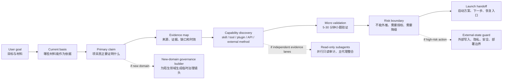

# Complex Project Front Governance

> A lightweight front-governance protocol for turning ambiguous, high-stakes project ideas into executable launch plans before implementation begins.

复杂项目最危险的地方，往往不是执行中写错一步，而是启动前没有说清楚：项目到底要证明什么、证据够不够、哪些工具该用、哪些风险不能越级、什么时候该停。这个仓库把这些启动前判断整理成一套可复用协议。

## What It Does

Complex Project Front Governance helps an AI agent or project lead do six things before execution:

1. Define the core claim the project is trying to prove.
2. Separate current evidence from drafts, history, assumptions, and generated output.
3. Discover useful skills, tools, plugins, APIs, external methods, and review lanes at the right time.
4. Run a small validation task before committing to a large plan.
5. Draw explicit risk and claim-readiness boundaries.
6. Produce a recoverable launch handoff with next steps, evidence gaps, and stop conditions.

## Workflow Map



## Why Each Step Exists

| Step | Purpose | Avoids | Typical Output |
| --- | --- | --- | --- |
| User goal | Capture the project intent in natural language. | Starting from a tool, file, or old template instead of the real goal. | One-sentence project objective and known materials. |
| Current basis | Decide what is authoritative now. | Treating old drafts, generated text, or historical notes as current facts. | `current_basis`, `not_current_basis`, evidence gaps. |
| Primary claim | Make the success claim explicit. | Confusing activity, output, outcome, and long-term impact. | Bounded claim and claim-readiness level. |
| Evidence map | Attach sources and evidence roles to key judgments. | Using official-looking sources to prove things they cannot support. | Evidence matrix, source role map, freshness notes. |
| Capability discovery | Reconsider skills, tools, plugins, APIs, and subagents at the start and at key transitions. | Tool tunnel vision, missing useful capabilities, or installing tools without a reason. | Selected, rejected, and backlog capabilities. |
| Micro validation | Test the riskiest assumption with a small task before expanding scope. | Building a large plan around an untested assumption. | Micro-task result, observed gap, downgrade rule. |
| Risk boundary | Write what cannot be concluded and what needs authorization. | Overclaiming deployment, public impact, safety, privacy, or production readiness. | Downgrade rule, manual action, external-state guard. |
| Launch handoff | Leave a recoverable next route. | Losing context when another agent or future session continues. | Human-readable summary and machine-readable next route. |

## How It Differs From Ordinary Project Kickoff

| Ordinary kickoff | Front-governed kickoff |
| --- | --- |
| Starts with tasks and deliverables. | Starts with the claim, evidence, and boundary of the project. |
| Treats available materials as mostly usable. | Separates authoritative input from background, history, and generated candidates. |
| Uses tools opportunistically. | Reconsiders capabilities at startup, stage transitions, blocked verification, external write boundaries, and final claims. |
| Validates late. | Runs a small validation task before committing to high-cost execution. |
| Writes polished conclusions early. | Binds conclusions to claim-readiness levels and downgrade rules. |
| Depends on chat memory. | Produces a handoff that another session can recover. |

## Quick Start

Use this natural-language entry point:

```text
This is an important project.
Goal: ...
Materials: ...
Expected result: ...

Please run the front-governance protocol first.
Do not jump directly into the final deliverable.
Keep the user-facing process lightweight, but write down the evidence, risks, and next route.
```

For Chinese-language work:

```text
这是一个重大项目。
目标是：……
已有材料在：……
我希望结果达到：……

请先按复杂项目启动前置治理协议推进。
不要直接写最终成品，不要把流程负担转嫁给我。
```

## Core Concepts

- `current_basis`: what can be used as current evidence.
- `new_domain_governance_builder`: builds a temporary governance lens for an unfamiliar domain.
- `capability_discovery_cadence_gate`: makes capability discovery explicit at the start and at key transitions.
- `skill_plugin_discovery_gate`: records which capabilities were considered, selected, rejected, or saved for later.
- `micro_task_execution_check`: requires a small real task or a clearly justified no-op before major expansion.
- `claim_readiness_ladder`: prevents source-backed or locally verified evidence from being written as public or production-ready claims.
- `anti_protocol_bloat_gate`: keeps single-case details in examples or backlog instead of bloating the core protocol.

## Skill and Capability Adoption

The protocol does not assume the current agent already knows the best way to work. At startup, stage changes, blocked verification, external-write boundaries, and final claims, it asks whether a skill, tool, plugin, API, library, subagent, or external method would improve the project.

Capabilities are adopted through a relevant-first smoke test, not by bulk installation. Each candidate is recorded as `adopt_now`, `adapt_later`, `backlog`, or `reject`, with a short reason and a promotion condition.

See [docs/skill_adoption.md](docs/skill_adoption.md) for the public adoption guide.

## Repository Structure

```text
.
├── README.md
├── LICENSE
├── protocol/
│   ├── core_protocol.md
│   └── gate_reference.md
├── examples/
│   └── startup_handoff_template.md
├── docs/
│   ├── skill_adoption.md
│   └── protocol_explainer_site/
└── tools/
    └── check_public_package.py
```

## Visual Explainer Site

The `docs/protocol_explainer_site` folder contains a small React/Vite visual explainer for the protocol.

```bash
cd docs/protocol_explainer_site
pnpm install
pnpm run build
pnpm exec vite preview --host 127.0.0.1 --port 8765
```

Then open:

```text
http://127.0.0.1:8765/
```

## Public Package Check

Run the public-package sanity check before publishing:

```bash
python3 tools/check_public_package.py
```

It checks required files and scans for common local-machine path leaks.

## What This Repository Intentionally Excludes

The public version excludes private/local working history, absolute machine paths, personal migration notes, long internal recovery logs, and project-specific historical evidence. The goal is to publish the reusable governance method, not a private workspace snapshot.

## License

MIT.
